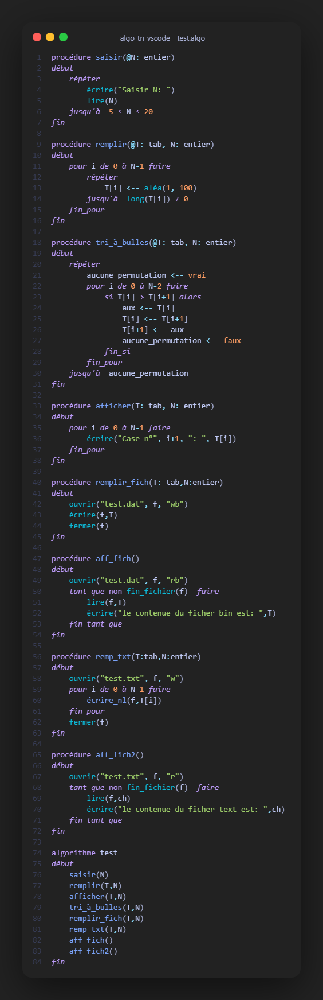

# Algorithm Tunisia - VS Code Extension & CLI

This repository contains the source code for the "Algorithme-tn" Visual Studio Code extension and its command-line interpreter.

## Project Structure

- `src/`: TypeScript source code for the lexer, parser, interpreter, and VS Code extension.
- `out/`: Compiled JavaScript code.
- `syntaxes/`: TextMate grammar for `.algo` files.
- `snippets/`: Code snippets for common algorithmic structures.
- `test/`: Test files and examples.
- `images/`: Icons and screenshots.

## 🚀 Installation & Setup

### Pour les Étudiants (Configuration Rapide)
1. **Télécharger l'Installer** : Allez dans la section **[Releases](https://github.com/Iyed2410/algorithme_executable/releases)** sur GitHub.
2. **Exécuter l'Installation** : Téléchargez et lancez **`setup_algo_tn.exe`**.
3. **Terminer** : L'installer configurera automatiquement la commande `algo` et l'extension VS Code sur votre ordinateur.

## 🛠 Utilisation

### Extension VS Code
- Ouvrez n'importe quel fichier `.algo` ou `.alg`.
- Appuyez sur **F5** ou cliquez sur le bouton **Play** en haut à droite.

### Commande CLI Globale
- Utilisez la commande `algo` dans n'importe quel terminal :
  ```bash
  algo mon_exercice.algo
  ```

### Exemple de Résultat


```text
algo test/test.algo
Saisir N: 
📥 N = 5
Case n°1: 72
Case n°2: 35
Case n°3: 94
Case n°4: 8
Case n°5: 69
le contenue du ficher bin est: [8, 35, 69, 72, 94]
le contenue du ficher text est: 8
le contenue du ficher text est: 35
le contenue du ficher text est: 69
le contenue du ficher text est: 72
le contenue du ficher text est: 94
```
